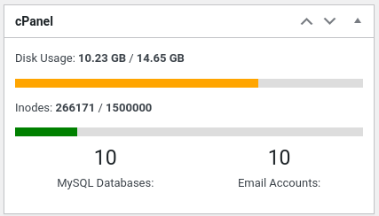

# cPanel-Widget-WordPress-Plugin
Adds a widget to the admin dashboard that detects if the current website is hosted on cPanel and displays the user quota, inodes, number of databases, email accounts, tc.

